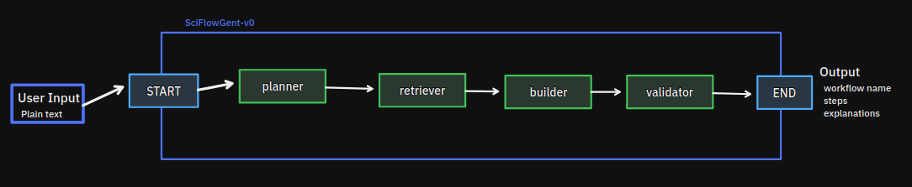

# SciFlowGent

**SciFlowGent** (Scientific Workflow Agent) is a multi-agent framework for generating Galaxy scientific workflows from natural language requests.

Users describe a scientific analysis task, provide input data types and desired outputs, and SciFlowGent recommends a workflow composed of Galaxy tools and processing steps. The system combines planning, retrieval, and validation agents to construct scientifically relevant and technically compatible workflows.

---

## Features

* Natural language workflow generation
* Galaxy tool and workflow retrieval from a local database
* Multi-agent planning architecture
* Tool compatibility validation
* Input/output type checking
* Explainable workflow construction

---

## Example

### User Request

> I have paired-end RNA-seq FASTQ files from control and treatment samples. I want differential expression analysis and a list of significantly upregulated genes.

### Generated Workflow

1. FastQC
2. Trimmomatic
3. HISAT2
4. FeatureCounts
5. DESeq2
6. Volcano Plot
7. Differential Expression Report

---

## System Architecture

---

## Agents

### Planner Agent

Responsible for understanding user intent.

Tasks:

* Analyze scientific objectives
* Infer missing workflow stages
* Determine required processing steps
* Generate a high-level workflow plan

Input:

* User request

Output:

* Workflow specification

---

### Tool Retrieval Agent

Finds relevant Galaxy tools.

Tasks:

* Search tool database
* Rank candidate tools
* Match tools to workflow stages

Input:

* Workflow specification

Output:

* Candidate tools per step

---

### Workflow Retrieval Agent

Retrieves similar workflows from a workflow repository.

Tasks:

* Search workflow examples
* Extract workflow patterns
* Provide workflow templates

Input:

* Workflow specification

Output:

* Relevant workflow examples

---

### Builder Agent

Constructs a workflow.

Tasks:

* Select tools
* Order workflow steps
* Connect tool outputs and inputs

Input:

* Candidate tools
* Workflow examples

Output:

* Workflow graph

---

### Validator Agent

Verifies workflow correctness.

Tasks:

* Check input/output compatibility
* Detect missing steps
* Detect invalid tool transitions
* Validate workflow structure

Input:

* Workflow graph

Output:

* Validation report
* Corrected workflow
